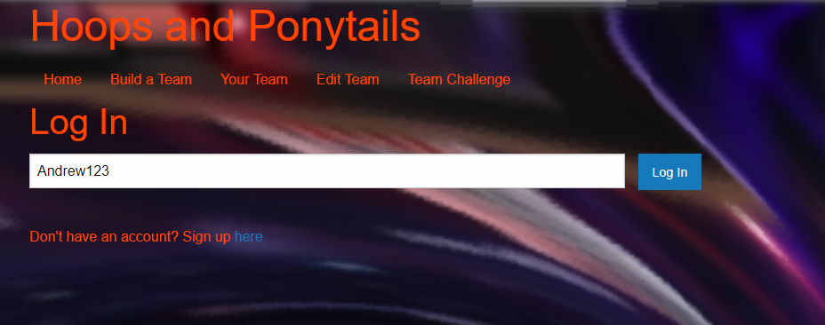
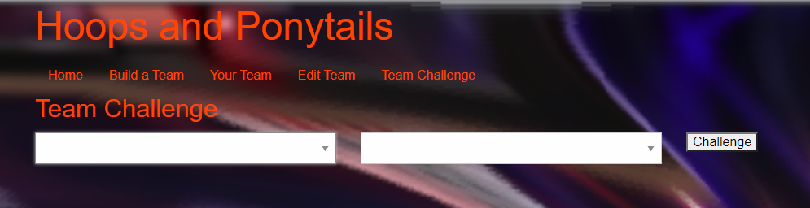

# project-2-group-15

# Hoops and Ponytails

  git dsvnvnkvs
  
  
  

## Description
Hoops and ponytails is a WNBA companion app that allows you to view player and team stats on demand. In addition, you can pit teams against one another in the team challenge mode. Simply follow on screen instructions to do so. This app was created using Node.js,handlebars, npm express, mysql, Heroku, anime.js, sequelize, and foundation styling elements.

    

## Table of Contents

  * [Installation](#Installation)
  * [Usage](#Usage)
  * [Licenses](#Licenses)
  * [Contributions](#Contributions)
  * [Tests](#Tests)
  * [Questions](#Questions)

## Installation
  Download onto your machine, make sure you have Node.js, npm express, sequelize, foundation, anime.js, and mysql installed. 

## Usage
  Run by following this heroku link __________-.

## Licenses
  This project is licensed under the MIT,GNU GPLv3,ISC,Apache 2.0 license(s). for more information regarding licensing feel free to visit
  [choose a license](https://choosealicense.com/)

## Contributions
  Please refer to email under the contacts heading to request editing permission.

## Tests
   

## Questions
 Please forward any questions to [agcmarcus@gmail.com](agcmarcus@gmail.com) . Please refer to the code for this project and others at [https://github.com/Andrew0502](https://github.com/Andrew0502).